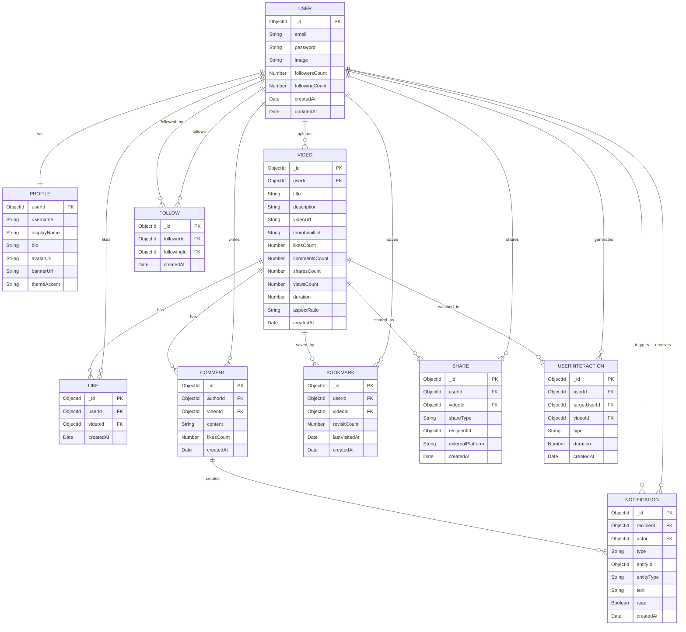

# Database Structure & Data Modeling

This document outlines the MongoDB schema design and relationships for the Social Media Application. The database is built using **Mongoose** for object modeling.

## 1. Overview

The database is designed to support a high-engagement social video platform ("Reels"). Key design principles include:
*   **Separation of Concerns**: User authentication data (`User`) is separated from public profile data (`Profile`).
*   **Performance**: Extensive indexing on frequently queried fields (e.g., `userId`, `videoId`, `createdAt`).
*   **Engagement Tracking**: Detailed tracking of likes, comments, shares, and bookmarks with counters on the main entities to reduce aggregation queries.
*   **Activity Feeds**: Specialized models (`Notification`, `UserInteraction`) to power activity feeds and recommendation algorithms.

---

## 2. Core Models

### 2.1 User
**Purpose**: Identity and Authentication.
**Collection**: `users`

| Field | Type | Required | Description |
| :--- | :--- | :--- | :--- |
| `_id` | ObjectId | Yes | Unique identifier. |
| `email` | String | Yes | Unique email address. |
| `password` | String | Yes | Hashed password. |
| `image` | String | No | Avatar URL (optional fallback). |
| `followersCount`| Number | No | Cached count of followers (Default: 0). |
| `followingCount`| Number | No | Cached count of following (Default: 0). |
| `createdAt` | Date | Yes | Account creation timestamp. |
| `updatedAt` | Date | Yes | Last update timestamp. |

### 2.2 Profile
**Purpose**: Public-facing user profile and customization.
**Collection**: `profiles`

| Field | Type | Required | Description |
| :--- | :--- | :--- | :--- |
| `userId` | ObjectId | Yes | Reference to **User**. Unique. |
| `username` | String | Yes | Unique handle (e.g., "johndoe"). |
| `displayName` | String | No | Display name (e.g., "John Doe"). |
| `bio` | String | No | User biography. |
| `avatarUrl` | String | No | URL to profile picture. |
| `bannerUrl` | String | No | URL to profile banner. |
| `themeAccent` | String | No | User's chosen theme color (Default: "#2DE2A6"). |

### 2.3 Video (Reel)
**Purpose**: The core content unit.
**Collection**: `videos`

| Field | Type | Required | Description |
| :--- | :--- | :--- | :--- |
| `userId` | ObjectId | Yes | Reference to **User** (Uploader). |
| `title` | String | No | Video title. |
| `description` | String | No | Video caption/description. |
| `videoUrl` | String | Yes | URL to the video file (e.g., ImageKit). |
| `thumbnailUrl` | String | Yes | URL to the video thumbnail. |
| `likesCount` | Number | No | Cached count of likes. |
| `commentsCount` | Number | No | Cached count of comments. |
| `sharesCount` | Number | No | Cached count of shares. |
| `viewsCount` | Number | No | Cached count of views. |
| `duration` | Number | No | Duration in seconds. |
| `aspectRatio` | String | No | Video aspect ratio (e.g., "9:16"). |

---

## 3. Social Graph & Engagement

### 3.1 Follow
**Purpose**: Manages the "Follow" graph between users.
**Collection**: `follows`
**Indexes**: Compound index on `[followerId, followingId]` (Unique).

| Field | Type | Required | Description |
| :--- | :--- | :--- | :--- |
| `followerId` | ObjectId | Yes | Reference to **User** (Who follows). |
| `followingId` | ObjectId | Yes | Reference to **User** (Who is being followed). |

### 3.2 Like
**Purpose**: Tracks user likes on videos.
**Collection**: `likes`
**Indexes**: Compound index on `[userId, videoId]` (Unique).

| Field | Type | Required | Description |
| :--- | :--- | :--- | :--- |
| `userId` | ObjectId | Yes | Reference to **User**. |
| `videoId` | ObjectId | Yes | Reference to **Video**. |

### 3.3 Comment
**Purpose**: User comments on videos.
**Collection**: `comments`

| Field | Type | Required | Description |
| :--- | :--- | :--- | :--- |
| `content` | String | Yes | The comment text. |
| `authorId` | ObjectId | Yes | Reference to **User**. |
| `videoId` | ObjectId | Yes | Reference to **Video**. |
| `likesCount` | Number | No | Count of likes on this comment. |

### 3.4 Bookmark (Saved)
**Purpose**: Allows users to save/bookmark videos for later. Includes "memory" features (revisit count).
**Collection**: `bookmarks`
**Indexes**: Compound index on `[userId, videoId]` (Unique).

| Field | Type | Required | Description |
| :--- | :--- | :--- | :--- |
| `userId` | ObjectId | Yes | Reference to **User**. |
| `videoId` | ObjectId | Yes | Reference to **Video**. |
| `revisitCount` | Number | No | How many times the user re-watched (Sort by Memory). |
| `lastVisitedAt` | Date | No | Timestamp of last interaction. |

### 3.5 Share
**Purpose**: specific share events.
**Collection**: `shares`

| Field | Type | Required | Description |
| :--- | :--- | :--- | :--- |
| `userId` | ObjectId | Yes | Reference to **User** (Sender). |
| `videoId` | ObjectId | Yes | Reference to **Video** (Shared content). |
| `shareType` | Enum | Yes | `copy_link`, `send_user`, `external`. |
| `recipientId` | ObjectId | No | Reference to **User** (If `send_user`). |
| `externalPlatform`| String | No | e.g., "twitter". |

---

## 4. System & Notifications

### 4.1 Notification
**Purpose**: Activity alerts for users.
**Collection**: `notifications`

| Field | Type | Required | Description |
| :--- | :--- | :--- | :--- |
| `recipient` | ObjectId | Yes | Reference to **User** (Receiver). |
| `actor` | ObjectId | Yes | Reference to **User** (Trigger). |
| `type` | Enum | Yes | `like`, `comment`, `follow`, `mention`. |
| `entityId` | ObjectId | No | Dynamic ID (Video ID, Comment ID, etc.). |
| `entityType` | Enum | No | `Reel`, `Comment`, `User`. |
| `text` | String | No | Preview snippets. |
| `read` | Boolean | No | Read status (Default: false). |

### 4.2 UserInteraction
**Purpose**: Analytics log for the recommendation engine (Watch history, profile views).
**Collection**: `userinteractions`

| Field | Type | Required | Description |
| :--- | :--- | :--- | :--- |
| `userId` | ObjectId | Yes | Reference to **User**. |
| `targetUserId` | ObjectId | No | Reference to **User** (If profile view). |
| `videoId` | ObjectId | No | Reference to **Video**. |
| `type` | Enum | Yes | `watch`, `like`, `comment`, `profile_view`. |
| `duration` | Number | No | Watch duration (seconds). |

---

## 5. Entity Relationship (ER) Diagram

